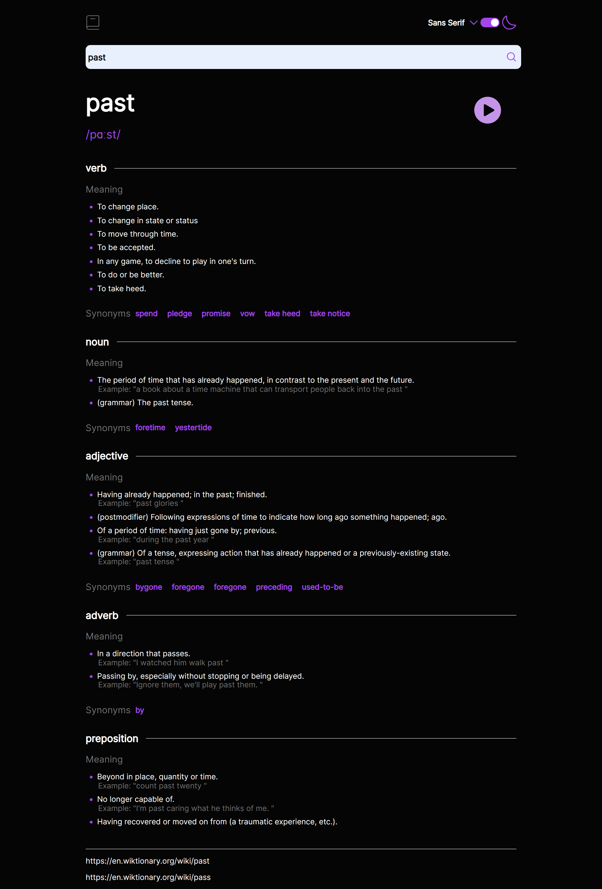

# Frontend Mentor - Dictionary Web App Solution

This is my solution to the [Dictionary web app challenge on Frontend Mentor](https://www.frontendmentor.io/challenges/dictionary-web-app-h5wwnyuKFL)

## Goal
I built a dictionary web app using the Dictionary API and get it looking as close to the design provide as possible.

## Built with

- React
- Sass
- Flexbox and Grid

## Requirements
✅ Search for words using the input field

✅ See the Free Dictionary API's response for the searched word

✅ See a form validation message when trying to submit a blank form

✅ Play the audio file for a word when it's available

✅ Switch between serif, sans serif, and monospace fonts

✅ Switch between light and dark themes

✅ View the optimal layout for the interface depending on their device's screen size

## Preview
